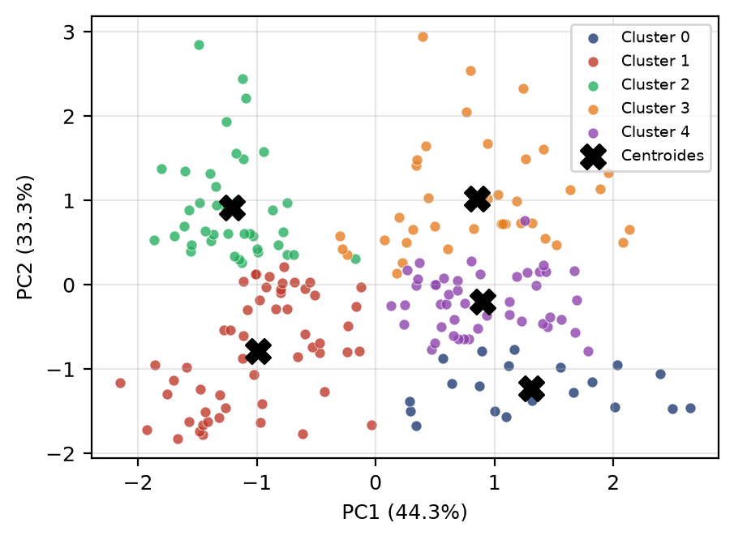

# 🛒 Segmentação de Clientes de Shopping com K-Means


> Um sistema abrangente de segmentação de clientes baseado em **K-Means**, com seleção criteriosa do número de grupos e tradução de clusters estatísticos em **personas acionáveis** com recomendações reais de marketing.

Trabalho desenvolvido para a disciplina de **Aprendizado de Máquina Não-Supervisionado (IMD0029)** no Instituto Metrópole Digital (IMD), UFRN.

## 🎯 Visão Geral

O projeto estrutura um **pipeline de dados ponta a ponta**:


* **Entrada:** Atributos demográficos (Idade, Renda Anual) e comportamentais (*Spending Score*).
* **Otimização de Clusters (k):** Decisão multicritério no intervalo $k \in \{2,\dots,10\}$:
  * 📉 Método do Cotovelo (Inércia intra-cluster / WCSS)
  * 👤 Coeficiente de Silhueta
  * 📊 Índice de Calinski-Harabasz (Razão de variância)
* **Motor Analítico & Visualização:** `scikit-learn` utilizando `k-means++` estabilizado com 50 inicializações para o modelo final. Redução de dimensionalidade via **PCA** (Análise de Componentes Principais) para projeção e visualização dos clusters em 2D.

## 📊 Resultados e Personas

Após a avaliação do pipeline, o modelo convergiu para **k=5 clusters**, revelando as seguintes personas principais:

* **📉 Maduro econômico (Grupo 0):** Foco em ofertas de baixo custo e descontos sazonais; possui baixa prioridade de investimento.
* **📱 Jovem entusiasta (Grupo 1):** Alvo para programas de fidelidade e engajamento digital; apresenta alto potencial de longo prazo.
* **💎 Premium ativo (Grupo 2):** Público ideal para serviços exclusivos, lançamentos e *cross-selling* de alto valor.
* **🔒 Conservador endinheirado (Grupo 3):** Foco em campanhas de conversão e benefícios para estimular gasto, priorizando a construção de confiança.
* **🎯 Público médio (Grupo 4):** Exige comunicação equilibrada e promoções generalistas, funcionando como um segmento de manutenção.



## 📂 Estrutura do Repositório

```text
📦 repo
 ┣ 📜 artigo.tex             # Artigo técnico completo (LaTeX padrão IEEE)
 ┣ 📜 artigo.pdf             # (Gerado) Artigo compilado em formato PDF
 ┣ 📂 figures                # (Gerado) Gráficos e diagramas de saída
 ┣ 📂 src                    # Código-fonte Python e dados
 ┃ ┣ 🐍 pipeline.py          # Lógica principal de análise, clusterização e plotagem
 ┃ ┣ 🐍 arch.py              # Script gerador do diagrama de arquitetura do artigo
 ┃ ┣ 🐍 gen_kmeans.py        # Script gerador do explicativo visual do K-Means
 ┃ ┣ 📊 Mall_Customers.csv   # Dataset base
 ┃ ┣ 📄 criteria.csv         # (Gerado) Tabela de métricas (Inércia, Silhueta, CH) por k
 ┃ ┗ 📄 profiles.csv         # (Gerado) Perfis médios (personas) dos clusters finais
 ┣ 🛠️ Makefile               # Automação de tarefas (instalação, builds, limpeza)
 ┣ 📝 requirements.txt       # Dependências estritas do projeto
 ┗ 📖 README.md              # Esta documentação
```

## 🚀 Como Reproduzir

### Pré-requisitos de Sistema (Debian/Ubuntu)

Para executar os scripts e compilar o PDF do artigo localmente, instale as dependências base do sistema de ambiente virtual (`venv`) e as coleções de pacotes do LaTeX:

```bash
sudo apt update
sudo apt install python3-venv texlive-publishers texlive-science texlive-lang-portuguese texlive-latex-extra
```

### Passo a passo

O repositório inclui um `Makefile` para automatizar as configurações. É necessário possuir `make` e `python3` instalados.

```bash
# 1. Cria o ambiente virtual e instala as dependências
make install

# 2. Executa a pipeline (gera as imagens) e em seguida compila o PDF do artigo
make all

# (Opcional) Executar as etapas de forma isolada:
# make run  -> Apenas gera os gráficos em /figures
# make pdf  -> Apenas compila o arquivo LaTeX

# 3. Limpa arquivos temporários (cache, log, PDFs temporários, .venv, etc)
make clean
```

> **Uso Avançado**: O script `pipeline.py` suporta customizações via linha de comando, permitindo a exploração de outros parâmetros e métricas. Para inspecionar os argumentos disponíveis:
> ```bash
> python src/pipeline.py --help
> # Exemplo prático:
> # python src/pipeline.py --k_chosen 5 --max_k 10 --seed 42
> ```

## 🗄️ Sobre os Dados

O conjunto de dados utilizado é o [Mall Customer Segmentation Data](https://www.kaggle.com/datasets/vjchoudhary7/customer-segmentation-tutorial-in-python), que contém 200 registros não rotulados de clientes de um shopping.

## 📖 Referências Base

* **MacQueen (1967)** — K-Means.
* **Rousseeuw (1987)** — Coeficiente de Silhueta.
* **Caliński & Harabasz (1974)** — Índice CH.
* **Jolliffe (2002)** — Principal Component Analysis (PCA).
* **Pedregosa et al. (2011)** — Ecossistema Scikit-learn.

## 👨‍💻 Autores

Trabalho desenvolvido pelos alunos do Bacharelado em Tecnologia da Informação do Instituto Metrópole Digital (IMD/UFRN):

* **Chistian Daniel Pereira da Silva** - [GitHub](https://github.com/ChisSilva)
* **Enock Gomes Neto** - [GitHub](https://github.com/enocknt)
* **Esdras Felipe Chaves Pinto Nascimento e Silva** - [GitHub](https://github.com/esdrasfelipe07)
* **Gabriel Santos da Silveira**
* **Glauco Ezequiel de Sousa Gonçalves**
* **Vitor Fraifer Palhano dos Anjos** - [GitHub](https://github.com/VitorFraifer)

## 📄 Licença

Este projeto está sob a licença MIT. Veja o arquivo [LICENSE](LICENSE) para mais detalhes.
